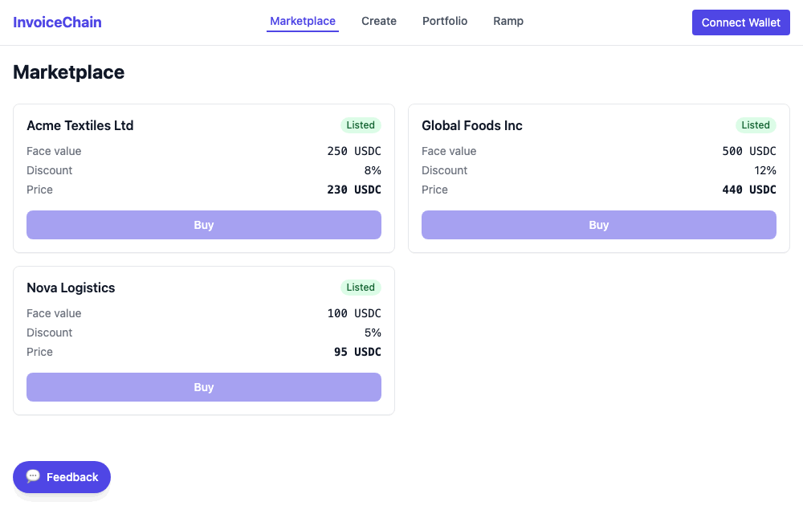

# Twitter/X Launch Thread — InvoiceChain (R9)

> How to use: each numbered block is one tweet, kept under the 280-character limit
> (links count as 23 chars on X). Tag the Stellar accounts: **@StellarOrg
> @BuildOnStellar**. Put the demo GIF (`docs/demo.gif`) on tweet 1 and screenshots on
> the next few tweets.

---

## Option A — Single tweet (250 chars, attach `docs/demo.gif`)

I built InvoiceChain — sell your unpaid invoices for cash today, on Stellar.

List one, someone buys it at a discount, you get paid now. And you don't need XLM to start: the first actions are gasless.

Demo: https://burcumengu.github.io/invoicechain

#Stellar #Soroban

---

## Option B — Full thread (5 tweets, each under 280)

**1/** I built InvoiceChain — sell your unpaid invoices for cash today, on Stellar.

A customer won't pay for 60 days? List that invoice, someone buys it at a discount, you get paid now. All on-chain.

Demo: https://burcumengu.github.io/invoicechain
🧵

📎 Attach this GIF to tweet 1:

**2/** How it works:

- List an invoice: amount, discount, due date, and who owes you
- An investor buys it at a discount and pays you now
- Your customer pays later, the investor collects the full amount
- Unpaid by the due date, it's marked defaulted

**3/** The best part: you don't need XLM to start.

New users usually have to buy crypto just to cover network fees, which scares a lot of people off. So the first few actions are gasless: a sponsor pays the fee, you just sign.

**4/** I audited the contracts before going near mainnet: found 10 issues, fixed or documented every one. No way to steal funds, no reentrancy.

Open source, built with Soroban + React.

Repo: https://github.com/BurcuMengu/invoicechain-mainnet

**5/** Full write-up on how I built it 👇
https://medium.com/@burcumengu/how-i-built-an-invoice-marketplace-on-stellar-and-made-it-work-without-xlm-d95598416e6

Try it, break it, tell me what's confusing. Feedback welcome 🙌

#Stellar #Soroban
